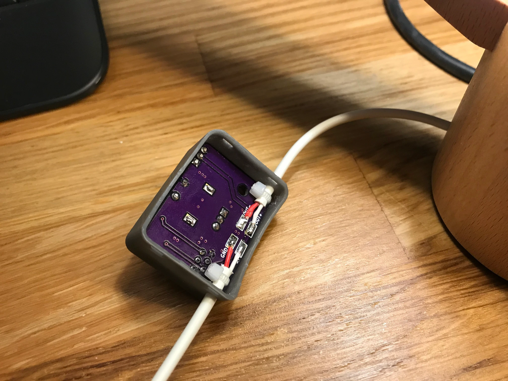
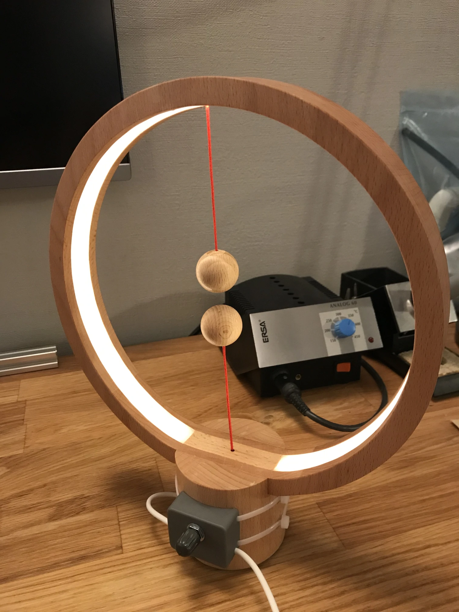

# Heng Balance Lamp Dimmer
This is a simple dimmer module that is designed for the Heng Balance Lamp that
materialized on [Kickstarter][1] a while back and is available through various
distributors.

## Circuit
The circuit was designed with components that I had at hand at the time.
Luckily, the lamp is powered via a USB power supply, so I could just pulse width
modulate the supply to the lamp in line. The switching transistor is a
[BUZ11][2] N-channel MOSFET. It's driven directly by one of the output compare
pins of the [ATtiny13A][3].

The user adjusts the PWM duty cycle (i.e. brightness) via a rotary encoder that
includes a push button switch. The wires are soldered directly to the underside
of the circuit board. Holes allow to install cable ties as strain relief.

## Firmware
The program configures the timer to run in fast PWM mode with a prescaler of 8.
Since I didn't change the clocking fuses, the microcontroller runs at 1.2MHz.
With the prescaler and the 8 bit resolution, the PWM frequency ends up being
586Hz which is sufficient to not see flicker.

7 distinct brightness levels can be selected by turning the rotary encoder.
Pushing it brings the lamp to full brightness if it wasn't already. It switches
the lamp completely off otherwise. This allows toggling between off and fully on
by pushing the button.

The encoder phase and button inputs are sampled every time the timer overflows,
i.e. with the same frequency as the PWM frequency. The button is debounced by
requiring it to be pushed for > 107ms.

*Note:* When the JTAGICE3 is attached to the board, the push button
functionality doesn't work reliably since the programmer seems to include a
pull-up resistor on the SCK line.

## Housing
The housing allows the populated circuit board to be fastened by the rotary
encoder nut. Unfortunately, the design doesn't allow the PCB to be taken out
once the cables are installed. Neither is it possible to access the programming
header once the cables are installed and the PCB is installed in the housing.

The big radius on the back side allows to fasten the entire unit to the round
base of the lamp using cable ties.

## Pictures

[1]:https://www.kickstarter.com/projects/1458079400/heng-balance-lamp-a-unique-lamp-with-switch-in-mid
[2]:https://www.onsemi.com/pub/Collateral/BUZ11-D.PDF
[3]:http://ww1.microchip.com/downloads/en/DeviceDoc/doc8126.pdf
